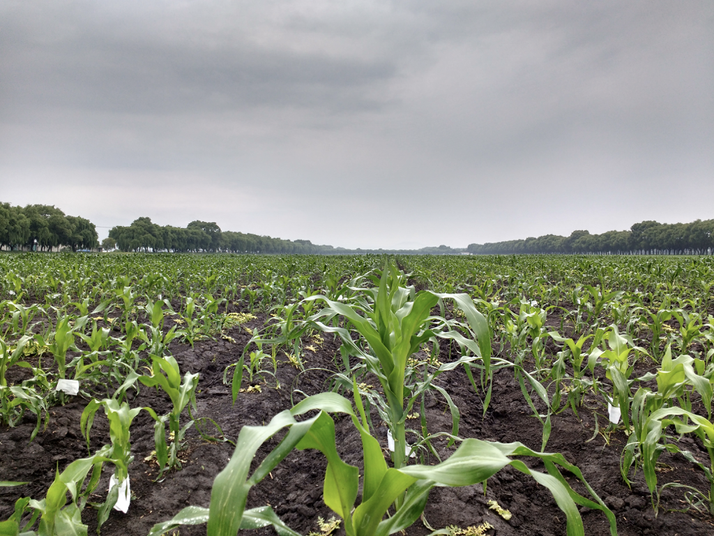

<!-- break -->
 
 
 
<!-- break -->

The Genetics of Highland Adaptation in Maize
--------------------

Welcome to webpage of The Genetics of Highland Adaptation in Maize [National Science Foundation project](https://nsf.gov/awardsearch/showAward?AWD_ID=1546719). 

 

 

## Background

Corn originated approximately 10,000 years ago in a hot, dry, low elevationr egion of southwest Mexico. While it has since spread globally and today has the greatest global geographic breadth of 16 staple crops, corn continues to perform poorly in the cold and yields are predicted to be negatively affected by climate change. However, farmers in various regions do cultivate corn in cool, wet mountainous regions as high as 12,000 ft above sea level. This project will identify the genetic changes that allowed corn to adapt to high elevations. The investigators will compare agronomic and genetic traits of corn varieties sampled at high elevation with those from nearby lowland regions in field experiments conducted at high, middle, and lowland sites. These experiments will help reveal important genes underlying high-elevation adaptation as well as quantify the repeatability of the genetic changes underlying adaptation. Results from this investigation will inform the development of cold-hardy corn lines for high-elevation and high-latitude (e.g. U.S. Corn Belt) regions. Insight as to how adaptation occurred in highland conditions can also be applied more broadly to adapting maize to other environmental conditions, including those caused by climate change. This project will foster collaboration between academics and industry and between the United States and Mexico, creating numerous opportunities for students, investigators, and farmers from these countries to interact and share expertise.  

## Project Objectives  

The genetic basis of plant adaptation to their local environments remains poorly characterized, despite its relevance to climate change and crop improvement. To better characterize the mechanisms and loci responsible for environmental adaptation in maize (Zea mays), the investigators will explore adaptation to high elevation environments in wild and domesticated populations of maize. Highland and lowland environments differ in a number of features including temperature and precipitation, and maize adaptation to these environments has involved a number of agronomically relevant phenotypes. The first objective is to identify quantitative trait loci for adaptive traits using mapping populations developed from Mexican and South American maize, a naturally admixed population of teosinte (i.e., wild maize) and two populations of introgression lines donated by industry collaborators. These populations will allow for comparison of the genetic architecture and effect sizes of loci controlling highland traits in distinct geographical regions, across elevations, and in multiple genetic backgrounds including elite US maize germplasm. The second objective is to investigate population genetic evidence of selection through studies of adaptive introgression in maize and teosinte, and divergence in gene expression between lowland and highland maize. The third objective is to characterize the functional consequences of an adaptive inversion polymorphism via phenotypic and transcriptomic evaluation of introgression lines. This basic research will be complemented by outreach activities including phenotyping workshops to demonstrate highthroughput field data collection methods, a student exchange between Mexico and the United States, and farmer field exhibitions in conjunction with a breeding center in Mexico.

