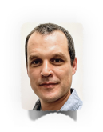

<!-- break -->
 
<!-- break -->

People
-------------
<!-- break -->
 
<!-- break -->

  
</a>

**Graham Coop**. Co-PI, UC Davis, *gmcoop@ucdavis.edu*  

Graham works on the development of mapping methods to detect admixture in teosinte parviglumis and mexicana hybrid zones. 

<!-- break -->
   
<!-- break -->

**Sherry Flint-García**. Co-PI, USDA-ARS University of Missouri, *Sherry.Flint-Garcia@ars.usda.gov*

Sherry has developed F2:3 mapping populations using two pairs of higland and lowland landraces from Mexico and South America and will perform QTL mapping of highland adaptation using these two mapping populations in in common garden experiments performed in highland and lowland sites. 

<!-- break -->
   
<!-- break -->

**Matthew Hufford**. Co-PI, Iowa State University, *mhufford@iastate.edu*  

Matt Hufford will assemble de novo genomes of the 4 parents of the F2:3 mapping populations and in the population genetics of teosinte adaptive introgression.

<!-- break -->
   
<!-- break -->

**Rubén Rellán-Álvarez**. Collaborator, Langebio, *ruben.rellan@cinvestav.mx*.  

Rubén Rellán-Álvarez is studying the role of glycerolipid metabolism in maize adaptation to highland conditions.  

<!-- break -->
   
<!-- break -->

**Jeffrey Ross-Ibarra**. PI, UC Davis, *rossibarra@ucdavis.edu*.  

Jeff Ross-Ibarra is analyzing the effect of adaptive introgression of teosinte mexicana in highland maize. 

<!-- break -->
   
<!-- break -->

**Daniel Runcie**. Co-PI, UC Davis, *deruncie@ucdavis.edu*.   

Daniel Runcie is analyzing allele specific expression data of B73 x landrace F1 crosses grown in the highland and lowland common garden to identify potential genes that have undergone directional selection for expression activity during adaptation to highland environments.  

<!-- break -->
   
<!-- break -->

**Ruairidh Sawers**. Co-PI, Langebio, *ruaridh.sawers@cinvestav.mx*.    

Ruairidh Sawers is performing functional characterization of adaptive QTLs including the possible effect of inv4m, a previously identified inversion in chr4 that is the result of teosinte mexican introgression in highland maize. 

